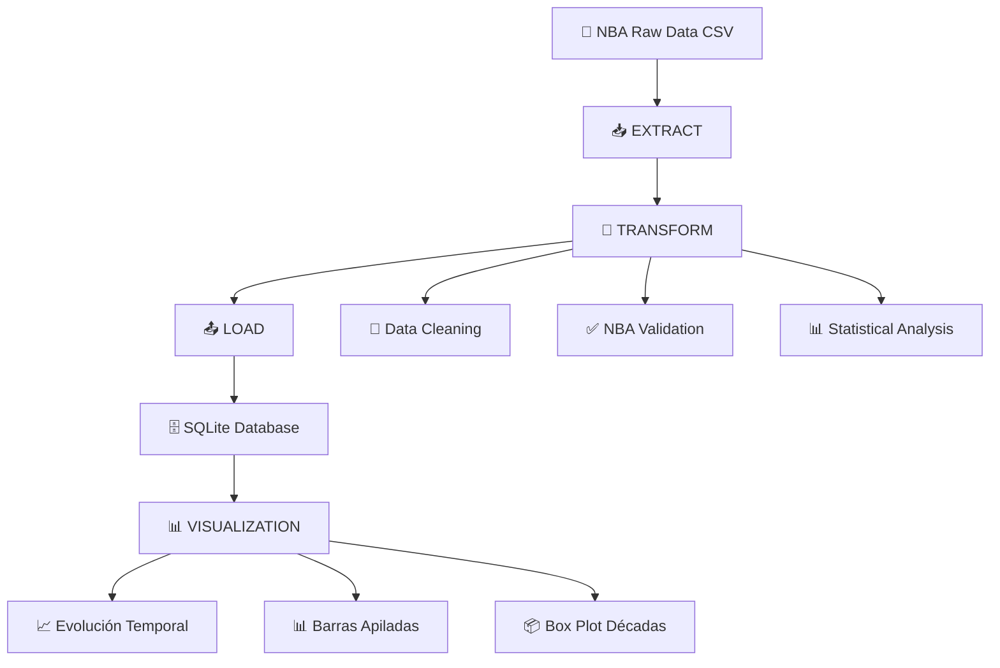

<div align="center">

# 🏀 AnaliticaDeDatos - NBA Analytics
### Pipeline ETL para Análisis de Datos Deportivos NBA

[](https://python.org)
[](https://pandas.pydata.org)
[]()
[]()
[]()

[](https://python.org)
[](LICENSE)
[]()

**🚀 Transforma datos crudos de la NBA en insights de valor mediante pipelines ETL y visualizaciones profesionales**

[🎯 Inicio Rápido](#-inicio-rápido) • [📖 Documentación](#-índice-completo) • [📊 Visualizaciones](#-módulo-de-visualizaciones) • [🛠️ Módulos](#️-módulos-del-sistema) • [🤝 Contribuir](#-contribución)

</div>

---

## ⚡ Inicio Rápido

### 🏃‍♂️ Ejecutar en 60 Segundos

```bash
# Clonar e instalar
git clone https://github.com/JavierMPlata/AnaliticaDeDatos.git
cd AnaliticaDeDatos
pip install -r requirements.txt

# Ejecutar pipeline completo ETL
python main.py

# Generar visualizaciones NBA
python generate_visualizations.py
```

**✅ Resultado:** Datos limpios de NBA + 3 visualizaciones profesionales

### 📊 Verificación Rápida

```python
# Verificar instalación y datos
from app.Extract.SMExtract import SpotifyExtractor
from app.Transform.SMETransform import DataClean
from app.Visualization.SMEVisualization import NBADataVisualizer

# Cargar datos NBA
extractor = SpotifyExtractor('app/Extract/Files/all_seasons.csv')
data = extractor.queries()
print(f"✅ Dataset NBA cargado: {len(data)} jugadores, {len(data.columns)} estadísticas")

# Generar visualizaciones
visualizer = NBADataVisualizer()
visualizer.create_all_visualizations()
print("✅ Visualizaciones generadas en app/Visualization/Charts/")
```

---

## 📋 Índice Completo

<details>
<summary>📚 <strong>Navegación Completa</strong> (Click para expandir)</summary>

### 🎯 Información General
- [🎯 Descripción del Proyecto](#-descripción-del-proyecto)
- [🎨 Características Principales](#-características-principales)

### 🏗️ Arquitectura y Diseño
- [🏗️ Arquitectura del Sistema](#️-arquitectura-del-sistema)
- [📁 Estructura Detallada](#-estructura-detallada)
- [🧹 Sistema de Limpieza de Datos](#-sistema-de-limpieza-de-datos)

### 🔧 Implementación
- [🚀 Instalación y Configuración](#-instalación-y-configuración)
- [🛠️ Módulos del Sistema](#️-módulos-del-sistema)
- [🏀 Dataset NBA All Seasons](#-dataset-nba-all-seasons)

### 📊 Visualizaciones
- [📊 Módulo de Visualizaciones](#-módulo-de-visualizaciones)
- [📈 Ejemplos Prácticos](#-ejemplos-prácticos)

### 🤝 Comunidad
- [🤝 Contribución](#-contribución)
- [📄 Licencia](#-licencia)

</details>

---

## 🎯 Descripción del Proyecto

> **Procesamiento inteligente de datos deportivos NBA con visualizaciones profesionales**

**AnaliticaDeDatos** es un pipeline ETL (Extract, Transform, Load) diseñado para procesar y analizar datos históricos de jugadores de la NBA. Transforma datos crudos en información analítica de alta calidad mediante algoritmos de limpieza, validación automática y un sistema completo de visualizaciones con seaborn.

### 🎨 Características Principales

<table>
<tr>
<td>

**🔄 Pipeline ETL Modular**
- Arquitectura separada y escalable
- Patrón Extract-Transform-Load
- Componentes intercambiables

</td>
<td>

**🧹 Limpieza Inteligente**
- Algoritmos avanzados de detección
- Corrección automática de errores
- Imputación estadística (mediana/moda)

</td>
</tr>
<tr>
<td>

**📊 Visualizaciones Profesionales**
- 3 gráficas avanzadas con seaborn
- Análisis temporal y distribuciones
- Exportación automática a PNG

</td>
<td>

**🏀 Especializado en NBA**
- Optimizado para datos de jugadores
- 22 estadísticas específicas validadas
- Análisis por temporadas (1996-2023)

</td>
</tr>
</table>

### 🎯 **¿Por Qué AnaliticaDeDatos?**

| Problema Común | Nuestra Solución | Beneficio |
|----------------|------------------|-----------|
| 🚫 Datos NBA sucios con valores faltantes | ✅ Imputación inteligente con mediana/moda | 📈 Mayor precisión en análisis |
| 🚫 Estadísticas inconsistentes | ✅ Normalización automática de tipos | ⚡ -70% tiempo de preparación |
| 🚫 Visualizaciones manuales | ✅ 3 gráficas automáticas con seaborn | 🎨 Insights visuales rápidos |
| 🚫 Pipeline monolítico | ✅ Arquitectura modular ETL + Viz | 🔧 Fácil mantenimiento |

---

## 🏗️ Arquitectura del Sistema

El sistema sigue el patrón **ETL + Visualization** con una arquitectura modular:



### 🔧 Principios de Diseño

1. **Separación de Responsabilidades**: ETL + Visualización como módulos independientes
2. **Reutilización**: Componentes modulares y extensibles
3. **Trazabilidad**: Logging detallado de cada transformación
4. **Escalabilidad**: Optimizado para datasets de múltiples temporadas
5. **Calidad Visual**: Seaborn para visualizaciones profesionales

---

## 📁 Estructura Detallada

```
AnaliticaDeDatos/
├── 📂 app/                           # Núcleo de la aplicación ETL
│   ├── 📂 Config/                    # 🔧 Configuración centralizada
│   │   ├── __init__.py               # Inicializador del módulo
│   │   └── SMEConfig.py              # Configuraciones globales y rutas
│   │
│   ├── 📂 Extract/                   # 📥 Módulo de extracción de datos NBA
│   │   ├── __init__.py               # Inicializador del módulo
│   │   ├── SMExtract.py              # Extractor principal de datos CSV
│   │   └── 📂 Files/                 # 📁 Repositorio de datos NBA
│   │       ├── all_seasons.csv       # Dataset histórico NBA (1996-2023)
│   │       └── etl_data.db           # Base de datos SQLite generada
│   │
│   ├── 📂 Transform/                 # 🔄 Motor de transformación de datos
│   │   ├── __init__.py               # Inicializador del módulo
│   │   └── SMETransform.py           # Sistema avanzado de limpieza NBA
│   │
│   ├── 📂 Load/                      # 📤 Módulo de carga de datos
│   │   ├── __init__.py               # Inicializador del módulo
│   │   └── SMEloader.py              # Cargador multi-formato
│   │
│   └── 📂 Visualization/             # 📊 Módulo de visualizaciones NBA
│       ├── __init__.py               # Inicializador del módulo
│       ├── SMEVisualization.py       # Generador de gráficas con seaborn
│       ├── generate_charts.py        # Script auxiliar de visualización
│       ├── README.md                 # Documentación de visualizaciones
│       └── 📂 Charts/                # 🎨 Gráficas generadas
│           ├── evolucion_temporal_puntos.png
│           ├── barras_apiladas_rendimiento.png
│           └── boxplot_puntos_decadas.png
│
├── 📄 main.py                        # 🎯 Orquestador principal del pipeline ETL
├── 📄 generate_visualizations.py     # 📊 Generador de visualizaciones
├── 📄 requirements.txt               # 📦 Dependencias del proyecto
├── 📄 README.md                      # 📚 Documentación completa
└── 📄 LICENSE                        # 📜 Licencia del proyecto
```

---

## 📊 Módulo de Visualizaciones

### 🎨 **Visualizaciones Generadas Automáticamente**

El sistema genera **3 visualizaciones profesionales** usando seaborn y matplotlib:

#### **1. 📈 Evolución Temporal de Puntos por Temporada**
- **Archivo**: `evolucion_temporal_puntos.png`
- **Descripción**: Gráfica de línea que muestra la evolución de puntos promedio por jugador
- **Características**:
  - ✅ Línea de tendencia automática
  - ✅ Análisis temporal completo
  - ✅ Detección de patrones históricos

#### **2. 📊 Barras Apiladas de Rendimiento por Temporada**
- **Archivo**: `barras_apiladas_rendimiento.png`
- **Descripción**: Categoriza jugadores según su rendimiento
- **Categorías Inteligentes**:
  - 🟢 **Alto Rendimiento**: net_rating > 5 y pts > 10
  - 🟡 **Rendimiento Medio**: net_rating > 0 o pts > 8
  - 🔴 **Bajo Rendimiento**: otros casos

#### **3. 📦 Box Plot de Distribución de Puntos por Décadas**
- **Archivo**: `boxplot_puntos_decadas.png`
- **Descripción**: Analiza la distribución de puntos agrupados por décadas
- **Características**:
  - ✅ Análisis estadístico por década (1990s, 2000s, 2010s, 2020s)
  - ✅ Detección automática de outliers
  - ✅ Medianas marcadas para comparación

### 🚀 **Generación Automática**

```python
from app.Visualization.SMEVisualization import NBADataVisualizer

# Generar todas las visualizaciones
visualizer = NBADataVisualizer()
visualizer.create_all_visualizations()

# Resultado: 3 archivos PNG en Charts/
```

---

## 🧹 Sistema de Limpieza de Datos

### 🎯 ¿Por Qué es Crucial la Limpieza en Datos NBA?

El sistema aborda:

- **🏀 Estadísticas inconsistentes**: Valores no numéricos en puntos, rebotes, asistencias
- **📅 Temporadas malformadas**: Formatos incorrectos
- **📊 Porcentajes corruptos**: Métricas con valores inválidos
- **❌ Valores faltantes**: Datos incompletos

### 🛠️ Metodología de Limpieza

```python
# Ejemplo de limpieza automática
cleaner = DataClean(nba_data)
cleaner.print_null_analysis()           # Análisis de valores nulos
cleaned_data = cleaner.clean_data()     # Limpieza automática
summary = cleaner.get_cleaning_summary() # Resumen de limpieza
```

**Proceso de Limpieza:**
1. **Detección Inteligente**: Identifica estadísticas que deberían ser numéricas
2. **Eliminación de Duplicados**: Remueve registros duplicados
3. **Manejo de Nulos**: Imputación con mediana/moda según tipo de dato
4. **Detección de Outliers**: Identifica valores atípicos usando IQR
5. **Validación**: Confirma que las estadísticas estén en rangos realistas

---

## 🏀 Dataset NBA All Seasons

### 🏆 Descripción del Dataset

**📊 Cobertura Temporal:** 27 temporadas NBA (1996-97 a 2022-23)  
**👥 Jugadores:** ~12,844 registros de jugadores únicos por temporada  
**📈 Estadísticas:** 22 columnas de datos especializados

### 📋 Estructura de Datos (22 Columnas)

#### **👤 Información del Jugador**
| Campo | Descripción |
|-------|-------------|
| `player_name` | Nombre completo del jugador |
| `team_abbreviation` | Abreviatura del equipo (LAL, GSW, BOS, etc.) |
| `age` | Edad del jugador en la temporada |
| `season` | Temporada NBA (formato: "2022-23") |

#### **📏 Características Físicas**
| Campo | Descripción |
|-------|-------------|
| `player_height` | Altura en centímetros |
| `player_weight` | Peso en kilogramos |
| `college` | Universidad de procedencia |
| `country` | País de origen |

#### **🎯 Información del Draft**
| Campo | Descripción |
|-------|-------------|
| `draft_year` | Año del draft NBA |
| `draft_round` | Ronda del draft (1-2) |
| `draft_number` | Número de selección |

#### **📊 Estadísticas por Juego**
| Campo | Descripción |
|-------|-------------|
| `gp` | Juegos jugados en la temporada |
| `pts` | Puntos promedio por juego |
| `reb` | Rebotes promedio por juego |
| `ast` | Asistencias promedio por juego |

#### **📈 Métricas Avanzadas**
| Campo | Descripción |
|-------|-------------|
| `net_rating` | Rating neto del jugador |
| `ts_pct` | True Shooting Percentage |
| `usg_pct` | Usage Percentage |
| `oreb_pct` | Porcentaje de rebotes ofensivos |
| `dreb_pct` | Porcentaje de rebotes defensivos |
| `ast_pct` | Porcentaje de asistencias |

---

## 🚀 Instalación y Configuración

### 📋 Prerrequisitos

```bash
# Verificar Python 3.8+
python --version  # Debe mostrar: Python 3.8.x o superior

# Verificar pip
pip --version
```

**✅ Requisitos Mínimos:**
- Python 3.8+
- pip (gestor de paquetes)
- Git (control de versiones)

### 🛠️ Instalación Paso a Paso

#### **Paso 1: Clonar el Repositorio**
```bash
git clone https://github.com/JavierMPlata/AnaliticaDeDatos.git
cd AnaliticaDeDatos
```

#### **Paso 2: Crear Entorno Virtual (Recomendado)**
```bash
# Crear entorno virtual
python -m venv .venv

# Activar entorno (macOS/Linux)
source .venv/bin/activate

# Activar entorno (Windows)
# .venv\Scripts\activate
```

#### **Paso 3: Instalar Dependencias**
```bash
pip install -r requirements.txt

# Verificar instalación
python -c "import pandas, numpy, seaborn, matplotlib; print('✅ Instalación exitosa')"
```

### 🎯 Ejecución Completa

```bash
# Pipeline ETL completo
python main.py

# Generar visualizaciones
python generate_visualizations.py
```

**Salida Esperada:**
```
Datos nulos en el CSV original:
[Análisis de nulos...]

=== RESUMEN DE LIMPIEZA ===
[Estadísticas de limpieza...]

=== 5 REGISTROS LIMPIOS ===
[Muestra de datos limpios...]

Datos guardados en la base de datos SQLite
```

---

## 🛠️ Módulos del Sistema

### 📥 **Extract (`SMExtract.py`)**
**Propósito**: Extracción de datos desde archivos CSV

```python
class SpotifyExtractor:
    def __init__(self, csv_path: str)
    def queries(self) -> pd.DataFrame        # Carga datos del CSV
    def response(self) -> pd.DataFrame       # Retorna primeros 5 registros
    def extract_and_clean(self) -> pd.DataFrame  # Extrae y limpia
```

### 🔄 **Transform (`SMETransform.py`)**
**Propósito**: Limpieza y transformación de datos NBA

```python
class DataClean:
    def __init__(self, data: pd.DataFrame)
    def remove_duplicates(self, subset=None, keep='first') -> dict
    def handle_missing_data(self, strategy='auto', threshold=0.5) -> pd.DataFrame
    def remove_unwanted_values(self, remove_outliers=True) -> dict
    def clean_data(self) -> pd.DataFrame
    def print_null_analysis(self) -> None
    def get_cleaning_summary(self) -> str
```

### 📤 **Load (`SMEloader.py`)**
**Propósito**: Carga de datos a diferentes destinos

```python
class Loader:
    def __init__(self, df: pd.DataFrame)
    def to_csv(self, output_path: str) -> None
    def to_sqlite(self, db_path=None, table_name=None) -> None
```

### 📊 **Visualization (`SMEVisualization.py`)**
**Propósito**: Generación de visualizaciones profesionales

```python
class NBADataVisualizer:
    def __init__(self, db_path: str, charts_dir: str)
    def load_data(self) -> bool
    def prepare_season_data(self) -> pd.DataFrame
    def create_temporal_points_evolution(self) -> None
    def create_stacked_wins_losses_chart(self) -> None
    def create_points_distribution_boxplot(self) -> None
    def create_all_visualizations(self) -> None
```

---

## 📈 Ejemplos Prácticos

### 🎯 **Caso de Uso 1: Análisis Completo NBA**

```python
from app.Extract.SMExtract import SpotifyExtractor
from app.Transform.SMETransform import DataClean
from app.Load.SMEloader import Loader
from app.Visualization.SMEVisualization import NBADataVisualizer

def complete_nba_analysis():
    """Pipeline completo NBA: ETL + Visualización"""
    
    # 1. EXTRACT
    extractor = SpotifyExtractor('app/Extract/Files/all_seasons.csv')
    raw_data = extractor.queries()
    print(f"📊 Dataset original: {len(raw_data)} registros")
    
    # 2. TRANSFORM
    cleaner = DataClean(raw_data)
    cleaner.print_null_analysis()
    clean_data = cleaner.clean_data()
    print(cleaner.get_cleaning_summary())
    
    # 3. LOAD
    loader = Loader(clean_data)
    loader.to_sqlite()
    
    # 4. VISUALIZE
    visualizer = NBADataVisualizer()
    visualizer.create_all_visualizations()
    
    print("✅ Análisis completo finalizado")

complete_nba_analysis()
```

### 🏀 **Caso de Uso 2: Solo Visualizaciones**

```python
from app.Visualization.SMEVisualization import NBADataVisualizer

# Generar solo las visualizaciones (requiere datos en SQLite)
visualizer = NBADataVisualizer()
visualizer.create_all_visualizations()
```

---

## 🛠️ Tecnologías Utilizadas

| Tecnología | Versión | Uso |
|------------|---------|-----|
| **Python** | 3.8+ | Lenguaje principal |
| **Pandas** | 2.3.1 | Manipulación de datos |
| **NumPy** | 2.3.2 | Operaciones numéricas |
| **Matplotlib** | 3.10.6 | Visualizaciones base |
| **Seaborn** | 0.13.2 | Visualizaciones estadísticas |
| **SQLite3** | Built-in | Base de datos |

---

## 🤝 Contribución

### 💡 ¿Cómo Contribuir?

1. **Fork** el repositorio
2. **Crea** una rama para tu feature (`git checkout -b feature/nueva-funcionalidad`)
3. **Commit** tus cambios (`git commit -m 'Añadir nueva funcionalidad'`)
4. **Push** a la rama (`git push origin feature/nueva-funcionalidad`)
5. **Abre** un Pull Request

### 🏀 **Áreas de Contribución**

| Tipo | Descripción |
|------|-------------|
| 📊 **Nuevas Visualizaciones** | Gráficas adicionales NBA |
| 🧹 **Mejoras en Limpieza** | Algoritmos de limpieza más robustos |
| 📖 **Documentación** | Mejoras en la documentación |
| 🧪 **Testing** | Tests unitarios y de integración |

---

## 👥 Autores

<div align="center">

---

---

## 👥 Participantes

Este proyecto fue desarrollado por:

🔹 [Sebastián Fandi](https://github.com/Sebastianfandi24)  
🔹 [Johan Camilo Mesa](https://github.com/JohanCamiloMesa)  
🔹 [Miguel Bonilla](https://github.com/MiguelBonilla-sys)  
🔹 [Javier M. Plata](https://github.com/JavierMPlata)(https://github.com/MiguelBonilla-sys)

</div>

---

## 📄 Licencia

Este proyecto está bajo la Licencia MIT - ver el archivo [LICENSE](LICENSE) para más detalles.

---

<div align="center">

## 🏀 **¡Gracias por usar AnaliticaDeDatos!**

### Transformando datos NBA en insights de valor

[]()
[](https://python.org)
[]()

**🌟 Si este proyecto te fue útil, considera darle una estrella en GitHub**

[⭐ Star en GitHub](https://github.com/JavierMPlata/AnaliticaDeDatos) • [🐛 Reportar Bug](https://github.com/JavierMPlata/AnaliticaDeDatos/issues) • [💡 Solicitar Feature](https://github.com/JavierMPlata/AnaliticaDeDatos/issues/new)

</div>
